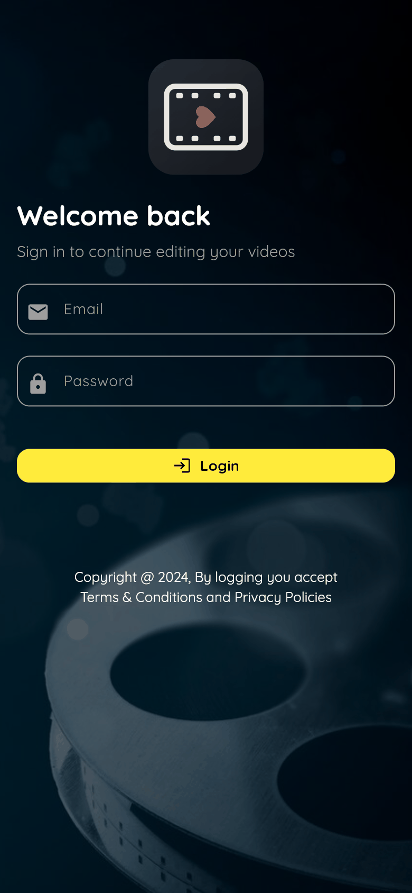
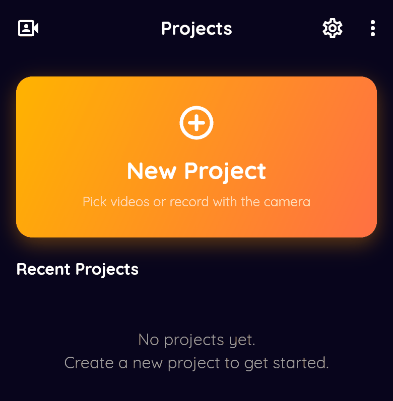
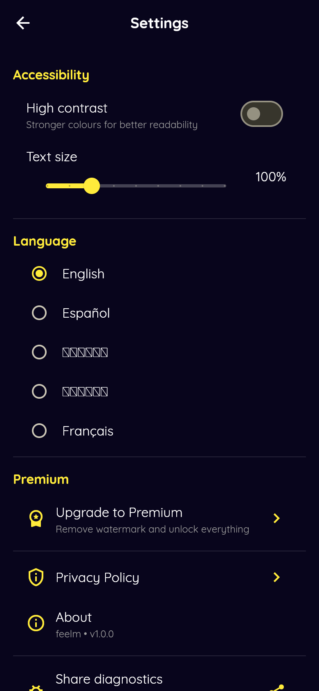
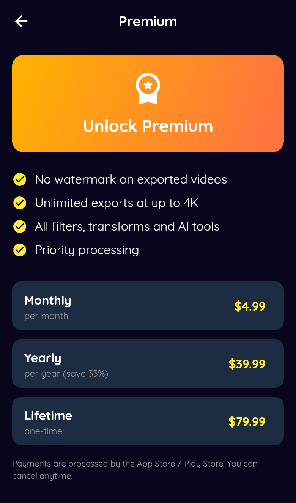

<div align="center">


# feelm

On-device video editor for Android and iOS, built with Flutter and FFmpeg, with offline AI tools.

[](https://github.com/sailenceresw/Feeling_Frame/actions/workflows/flutter.yml)
[](LICENSE)


[Quickstart](#quickstart) · [Screenshots](#screenshots) · [Features](#features) · [AI features](#ai-features) · [Architecture](docs/ARCHITECTURE.md) · [Roadmap](#roadmap) · [Contributing](CONTRIBUTING.md) · [Security](SECURITY.md)

</div>

feelm is a Flutter app that edits video on the device. Trimming, effects,
overlays, and export run through FFmpeg locally. The AI tools (object detection,
noise reduction, stabilization, auto-highlights) run on-device with no account
or network. It is a solo, pre-release project: the login is a demo, and premium
is a local flag, both called out below.

## Quickstart

Prerequisite: the Flutter SDK. Built and tested on Flutter 3.44.8.

```bash
flutter pub get

# Android
flutter run

# iOS (macOS only)
cd ios && pod install && cd ..
flutter run
```

Sign in with the demo login below, tap New Project, pick a clip, and edit.

## Screenshots

Captured from the app running in a phone viewport.

<table>
  <tr>
    <td></td>
    <td></td>
    <td></td>
    <td></td>
  </tr>
  <tr>
    <td align="center">Login</td>
    <td align="center">Dashboard</td>
    <td align="center">Settings</td>
    <td align="center">Premium</td>
  </tr>
</table>

## Features

Editing tools, grouped by what they do. Each tool has its own screen under
`lib/src/screens/editor/` and a service under `lib/src/services/`.

- Cut and reframe: trim, crop, rotate, speed, loop, fade in and out.
- Compose: merge multiple clips, picture in picture, split screen, slideshow,
  transitions.
- Look: color adjust, VFX, borders, region blur, watermark, and filter presets
  (Sepia, Grayscale, Warm, Cool, Vintage, Invert, and more).
- Text and graphics: text overlays with font size and color, a caption studio,
  a thumbnail designer, meme captions, and a GIF studio.
- Audio: volume control and audio cleanup.
- Export: choose resolution (down to 480p) and quality to shrink file size, with
  a live progress indicator. Overlays are burned into the exported file.
- Multi-format output: video, animated GIF, extracted audio (MP3), and a cover
  image.

A persistent Recent Projects list, five UI languages, a high-contrast theme,
and app-wide text scaling are in Settings.

For how these fit together, see [docs/ARCHITECTURE.md](docs/ARCHITECTURE.md).

## AI features

Reached from AI mode in the editor.

On-device, offline, no account:

- Object detection with ML Kit image labeling.
- Noise reduction, video stabilization, and auto-highlights (scene detection).
- Auto Frame reframes toward a detected subject.
- Captions can be typed, pasted, or imported from SRT, then burned in.

<details>
<summary>Optional Google Cloud transcription</summary>

Auto speech transcription can use Google Cloud Video Intelligence. Nothing is
bundled and the app works without it. Pass a service account at run time and
never commit it:

```bash
flutter run --dart-define=GCP_SERVICE_ACCOUNT_JSON="$(cat service_account.json)"
```

On-device auto-generated captions are not wired yet: the speech pipeline exists
but no recognizer model ships. See the roadmap.

</details>

## Demo login

The login is not real authentication yet. It accepts one hardcoded account and
routes into the app. This is tracked in
[issue #31](https://github.com/sailenceresw/Feeling_Frame/issues/31) and will be
replaced before real users.

```
Email    : test@gmail.com
Password : 123456
```

## Requirements

- Flutter SDK `>=3.2.6 <4.0.0`, verified on 3.44.8.
- Android: `minSdkVersion 24`, `compileSdkVersion 34`.
- iOS: deployment target 15.5, required by the on-device ML Kit pods.

## Where exports go

- Android: the public Download folder, falling back to app storage.
- iOS: the app documents directory, reachable through the Files app.

## Roadmap

Open work is tracked in
[GitHub issues](https://github.com/sailenceresw/Feeling_Frame/issues), grouped
by phase labels `v0.1-hardening`, `v0.2-on-device-ai`, `v0.3-validation`, and
`v1.0-release`. Hard gates before real users carry the `gate:before-users`
label. Longer notes on deferred features live in [FUTURE_WORK.md](FUTURE_WORK.md).

## Contributing and policies

- [CONTRIBUTING.md](CONTRIBUTING.md) has setup, conventions, and what will be
  declined.
- [SECURITY.md](SECURITY.md) has the private disclosure route and known
  weaknesses.
- [CODE_OF_CONDUCT.md](CODE_OF_CONDUCT.md) applies to participation here.

## License

AGPL-3.0. See [LICENSE](LICENSE). The app links the full-GPL FFmpeg build
through `ffmpeg_kit_flutter_new`, so a copyleft, GPL-compatible license is
required; a permissive license would conflict.

<details>
<summary>Troubleshooting and notes</summary>

- First iOS build is slow. `ffmpeg_kit_flutter_new` ships large native
  binaries, so the first `pod install` and build take a while.
- ML Kit raises the iOS floor. The object detection pods need iOS 15.5, so older
  simulators will not run.
- Regenerate launcher icons after changing `assets/images/app_logo.png`:

  ```bash
  dart run flutter_launcher_icons
  ```

- Web is not a supported target. The project compiles for web, but FFmpeg and ML
  Kit have no web implementation and the video-pick flow returns bytes rather
  than a path, so editing does not function in a browser.
- Two `dependency_overrides` in `pubspec.yaml` (`win32` and
  `flutter_plugin_android_lifecycle`) are needed to build on current Flutter.
  Each has a comment explaining why.

</details>
